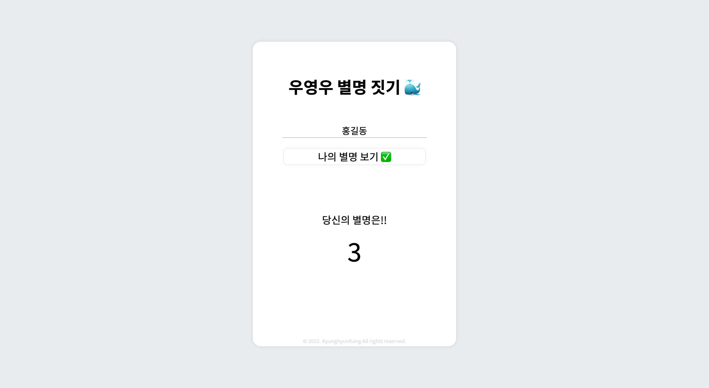

# 우영우 닉네임 짓기

## 배포 URL

[https://wooyoungwoo-nickname.netlify.app](https://wooyoungwoo-nickname.netlify.app)  
[https://mucent.github.io/wooyoungwoo-nickname](https://mucent.github.io/wooyoungwoo-nickname)

## 기능

- 이름을 입력하면 3초 카운트다운 후 랜덤 닉네임을 보여줍니다.
- '다시 해보기 🐬'를 통해 새로운 닉네임을 받을 수 있습니다.

## Tech Stack

